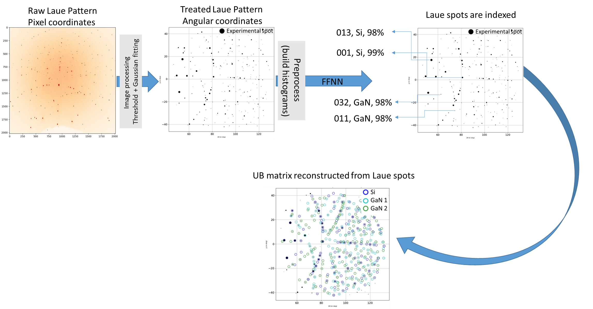
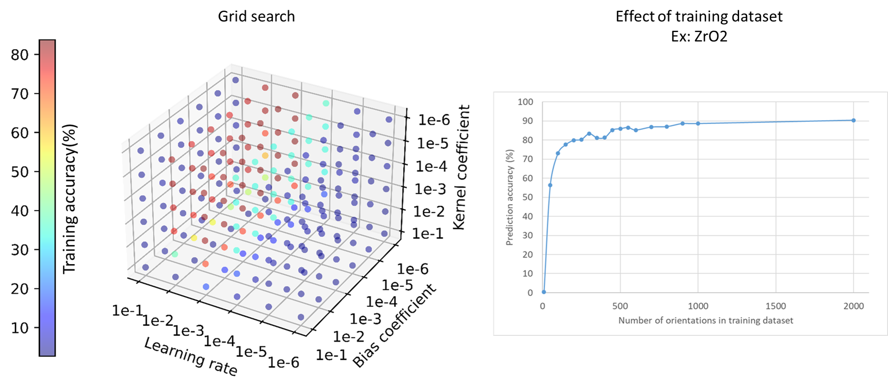

====================================
What are we predicting with LaueNN
====================================

LauetoolsNN does not replace the complete Laue indexation workflow, it still relies heavily on the classical indexation approach to indexing Laue patterns (here using the `Lauetools module <https://pypi.org/project/LaueTools/>`_.)
What has been replaced in the classical approach with LaueNN is to predict the Laue indices or hkl of each Laue spots in th eimage. By doing so, we can greatly accelerate the whole indexation process. 

The image below shows, that for a given Laue image recorded by a 2D detector (here the image comes from a GaN nanowire placed on Si substrate). The Laue image consist of contribution from both Silicon and GaN crystals. We have trained a neural network with GaN and Si material. The input image after some pre processing is fed to the Feed Forward Neural Network, and the network predicts 'hkl,Material,accuracy_of_prediction' for each spots. WIth this knowledge, the UB or orientation matrix of each phase can be reconstructed quickly, thereby indexing the crystals present in your Laue pattern. All this takes <1s on a standard laptop.

In the classical approach, however, we have try lot of brute force to identify the Si crystal first, then remove the spots that comes from Si crystal from the Laue image and then again try to index the GaN crystal with brute force.

The Neural network architecture presented in the code is already a well optimized ones (as shown below). Several factors contributing to the loss minimization has been studies and are kept as default values in the model. This works very well from cubic to triclinic symmetry.

